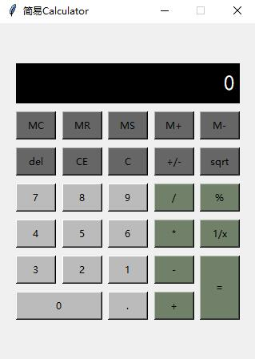

# Mini-Tools

### Image-Edit

##### 几个基本的图片编辑工具，包括一下功能：

+ 文件：打开，保存，退出
+ 编辑：放大，缩小，灰度，亮度，旋转，截图
+ 变换：傅里叶变换，离散余弦变换，Radon变换
+ 噪声：高斯，椒盐，斑点，泊松
+ 滤波：高通，低通，平滑，锐化
+ 直方图统计：R直方图，G直方图，B直方图
+ 图像增强：伪彩色，真彩色，直方图均衡，NTSC颜色模型，YCbCr颜色模型，HSV颜色模型
+ 阈值分割
+ 生态学处理
+ 特征提取
+ 图像分类与识别


##### 库文件需要
```
 1. PyQt5
 2. sys
 3. os
 4. opencv2
 5. numpy
 6. scipy
 7. matplotlib
 ```

### Beautify-Camera

##### 主要功能

+ 文件：打开，保存，打开摄像头
+ 操作：还原，人脸识别
+ 滤镜：怀旧，木刻，灰色，彩色，风格化，增强细节
+ 调节：亮度，饱和度，伽马变换，边缘保持
+ 磨皮美白：美白度，磨皮程度，磨皮精度
+ 灰度直方图


##### 库文件需要
```
 1. PyQt5
 2. sys
 3. opencv2
 4. numpy
 5. matplotlib
```

##### 相关代码说明
+ 人脸识别
```
# 人脸识别
    def detect_face(self):
        img = self.raw_image
        face_cascade = cv2.CascadeClassifier('./haarcascade_frontalface_default.xml')

        gray = cv2.cvtColor(img, cv2.COLOR_BGR2GRAY)
        faces = face_cascade.detectMultiScale(gray, 1.3, 5)
        return faces
   ```
+ 皮肤识别
```
# 皮肤识别
    def detect_skin(self):
        img = self.raw_image
        rows, cols, channals = img.shape
        for r in range(rows):
            for c in range(cols):
                B = img.item(r, c, 0)
                G = img.item(r, c, 1)
                R = img.item(r, c, 2)
                if (abs(R - G) > 15) and (R > G) and (R > B):
                    if (R > 95) and (G > 40) and (B > 20) and (max(R, G, B) - min(R, G, B) > 15):
                        self.imgskin[r, c] = (1, 1, 1)
                    elif (R > 220) and (G > 210) and (B > 170):
                        self.imgskin[r, c] = (1, 1, 1)
```
+ 其他不做详解

### Calculator
##### 主要功能
+ 基本的加减乘除和开根号等运算



##### 库文件需求
```
1.math
2.tkinter
```

### pyQt5-Calculator
##### 主要功能
+ 基本的加减乘除和开根号等运算

1.calculator.py


2.Calculator_.py


##### 库文件需求
```
1.PyQt5
2.sys
3.math
```

### Painting绘画
##### 主要功能
+ File：新建画板，打开图片，保存图片
+ Edit：复制，清空画板
+ Image：翻转
+ 工具：基本画笔，橡皮擦，图形创建工具等
+ 编辑区，色彩调节区，字体调节区等

##### 库文件需求
```
1.PyQt5
2.random
3.type
4.os
```


### NotePad
##### 主要功能
+ 基本文本编辑，类似于记事本

##### 库文件需求
```
1.pyQt5
2.sys
3.os
```

